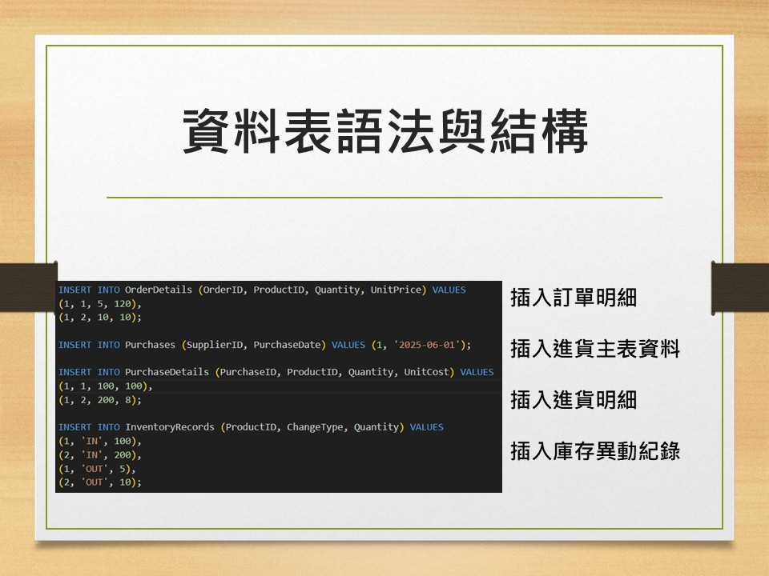

##系統文件：訂單／進銷存資料庫系統

## 一、需求說明

本專題旨在設計一套「訂單／進銷存資料庫系統」，協助企業有效管理商品的進貨、銷售與庫存狀況。系統以關聯式資料庫為基礎，涵蓋資料表設計、正規化、查詢與進階功能（如視圖、儲存程序、觸發器等），以支援企業日常營運所需的資料處理與分析功能。

## 二、功能模組

### 1. 客戶與供應商管理

- **客戶管理**：記錄姓名、電話、地址等基本資訊。
- **供應商管理**：記錄名稱、聯絡人、聯絡電話等資訊。

### 2. 商品管理

商品資訊包含：名稱、單價、單位、初始庫存量、供應商來源。
支援從供應商進貨，並自動調整庫存。

### 3. 訂單管理

每筆訂單對應一位客戶。
每筆訂單可包含多筆商品明細（數量、單價）。
自動計算總金額並更新庫存異動。

### 4. 進貨管理

建立進貨單並對應供應商。
每筆進貨單可包含多項商品與進貨數量、成本。
自動新增庫存異動紀錄。

### 5. 庫存異動管理

每筆進貨與出貨（訂單）會產生一筆「IN / OUT」的異動記錄。
可查詢每項商品的：
總進貨量
總出貨量
即時庫存

### 6. 查詢與分析報表功能

查詢每位客戶的訂單與總金額。
商品銷售總量排行。
商品與供應商資料一覽。 
商品目前庫存與安全存量警示。
各商品歷史異動記錄（IN/OUT 明細）。

### 7. 進階 SQL 應用功能

使用 `VIEW` 建立熱門商品檢視表。
撰寫 `Stored Procedure` 處理訂單邏輯。
使用 `Trigger` 自動記錄庫存異動。
使用 `Transaction` 確保訂單資料一致性。

## 三、資料表結構與 SQL 匯出

          

---

製作團隊：楊竣安、陳奕嘉  
日期：2025-06
